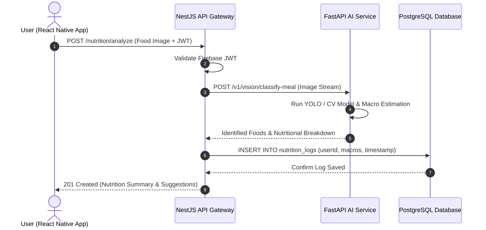
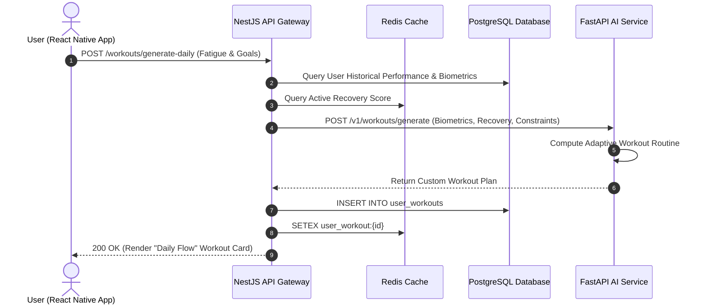
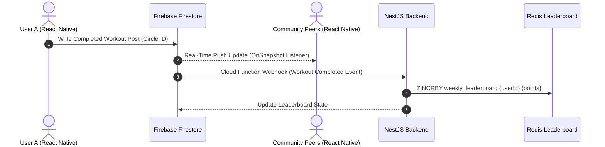

# Architecture Decision Record (ADR)

## ADR 001: Selection of Core Architecture & Technology Stack for FitFlow Redesign

| Field | Details |
| :--- | :--- |
| **Status** | **Accepted** |
| **Date** | 2026-09-20 |
| **Author** | FitFlow Engineering & HCI Research Team |
| **Project** | FitFlow Redesign (SLIIT IT3060 - HCI Lab Exercise 05) |
| **Deciders** | Lead Architect, Product Manager (Priya Sharma), Data Science Lead |

---

## 1. Context

FitFlow is a health-tech fitness tracking platform undergoing a full-scale redesign after experiencing significant user drop-off (retention dropped, app store rating fell from 4.6 to 3.8 stars). Research showed that **68% of users abandoned the app shortly after onboarding** due to:
1. High friction in manual nutrition logging.
2. Generic, rigid workout routines lacking personalization for busy professionals (Persona: *Alex Rivera*).
3. Feelings of social isolation and absence of accountability during fitness journeys (Persona: *Priya Singh*).

To address these pain points, the redesign introduces three core capabilities:
- **Camera-based Nutrition Logging:** Computer vision inference to identify meals and estimate macros instantaneously.
- **AI-Powered Personalized Workouts:** Dynamic, adaptive daily workout regimens based on biometric feedback and progress.
- **Real-Time Social Community:** Private circles, live workout feeds, leaderboards, and peer encouragement.

The technical architecture must support rapid cross-platform mobile delivery, compute-heavy AI inference, real-time social dynamics, strict health data compliance (GDPR/HIPAA), and high maintainability for a mid-sized engineering team.

---

## 2. Decision

We have decided to adopt a **Polyglot Microservice & Hybrid Data Architecture** comprising:
1. **Frontend:** **React Native** (TypeScript, Expo SDK 51, Reanimated 3) targeting iOS, Android, and Web.
2. **Core Backend / API Gateway:** **NestJS (Node.js)** for business logic, authentication guards, user management, and workout tracking.
3. **AI / Computer Vision Microservice:** **Python + FastAPI** for running meal image classification models (YOLO / OpenCV) and AI workout generation algorithms.
4. **Hybrid Database Layer:**
   - **PostgreSQL:** Primary relational database for ACID-compliant storage of user profiles, health metrics, workout histories, and billing.
   - **Firebase Firestore:** Real-time NoSQL document store for the community feed, social interactions, challenges, and notifications.
5. **Authentication:** **Firebase Authentication** (OAuth 2.0 with Google, Apple, and Email/Password) integrated with NestJS JWT verification.
6. **Caching & Message Broker:** **Redis** for in-memory caching (leaderboards, frequent user metrics) and API rate limiting.

---

## 3. Rationale

1. **Decoupling I/O and Compute:** Node.js/NestJS excels at high-concurrency, asynchronous I/O (handling thousands of mobile client requests with minimal overhead). However, computer vision and machine learning inference are CPU/GPU-intensive tasks best implemented in Python’s ecosystem (PyTorch, TensorFlow, OpenCV). Decoupling these into a dedicated FastAPI microservice prevents heavy ML tasks from blocking the core user-facing API.
2. **Hybrid Data Strategy (Relational + Real-time):**
   - Health and fitness telemetry data require strict relational consistency, schema enforcement, and auditability (PostgreSQL).
   - Social feeds, comment streams, and live leaderboard updates require sub-second push synchronization and offline tolerance on mobile devices, which Firestore provides natively without maintaining custom WebSocket infrastructure.
3. **Developer Velocity & Type Safety:** Using TypeScript across both React Native and NestJS enables shared data interfaces and DTOs, reducing serialization bugs and accelerating feature delivery.
4. **Security & Compliance:** Firebase Auth offloads sensitive credential handling, ensuring GDPR and HIPAA compliance while reducing liability for a mid-sized team.

---

## 4. Critical Data Flows

### 4.1 Feature 1: Camera-Based Nutrition Logging
1. User captures a food image in the **React Native** app.
2. The image is uploaded via multipart request through the **NestJS API Gateway** (verifying Firebase JWT).
3. NestJS proxies the image stream to the **FastAPI AI Microservice**.
4. The AI microservice runs object detection (YOLO/OpenCV) to identify food items, cross-references an internal nutritional database, and returns recognized foods with estimated macronutrients.
5. NestJS saves the verified meal record to **PostgreSQL** and returns the structured nutrition log to the client.

### 4.2 Feature 2: AI-Powered Personalized Workout Generation
1. User inputs daily availability, current fatigue score, and fitness goals.
2. **NestJS** fetches the user's historical performance and recovery metrics from **PostgreSQL** and **Redis**.
3. NestJS calls the **FastAPI AI Microservice** (`POST /v1/workouts/generate`).
4. The AI service evaluates constraints and outputs an adaptive, personalized routine.
5. The routine is persisted in **PostgreSQL** and cached in **Redis** for instant mobile retrieval.

### 4.3 Feature 3: Real-Time Social Sharing & Community Challenges
1. User completes a workout and shares their achievement to a private circle.
2. The client writes directly to **Firebase Firestore** (governed by Firestore Security Rules authenticated by Firebase Auth).
3. All connected peer clients receive real-time document snapshot updates via Firestore listeners.
4. An event trigger notifies **NestJS** to update aggregate leaderboard scores in **Redis** and **PostgreSQL**.

---

## 5. Security, Scalability & Compliance Considerations

- **HIPAA & GDPR Compliance:** Sensitive user health metrics (weight, heart rate, personal biometrics) are stored in PostgreSQL with encryption at rest (AES-256) and in transit (TLS 1.3). Explicit user consent logs are maintained.
- **Stateless Authentication:** Stateless JWTs issued by Firebase Auth allow NestJS and FastAPI services to scale horizontally behind load balancers without shared session state.
- **Rate Limiting:** Redis-backed sliding window rate limiters protect AI endpoints against denial-of-service and excessive compute usage.
- **Fail-Safe Offline Mode:** React Native and Firestore provide offline persistence so users can log exercises even without network connectivity in gym basements.

---

## 6. Consequences

### Positive Consequences
- **Independent Scalability:** The compute-intensive AI microservice can be scaled horizontally on GPU-enabled nodes independently of the I/O-bound NestJS backend.
- **Fast HCI Prototyping:** Single React Native codebase allows fast iteration on UX wireframes and usability testing feedback without duplicate mobile code.
- **Zero Real-Time Overhead:** Leveraging Firestore removes the need to build and maintain custom WebSocket clustering and connection heartbeat infrastructure.

### Negative Consequences / Trade-offs
- **Operational Complexity:** Managing two backend runtimes (Node.js and Python) alongside two database systems requires robust CI/CD and Dockerized orchestration.
- **Data Synchronization Overhead:** Cross-referencing relational user data in PostgreSQL with social activities in Firestore requires strict domain boundary enforcement.

---

## 7. Rejected Alternatives

1. **Monolithic Python Backend (Django / FastAPI alone):**
   - *Reason for Rejection:* While Python is ideal for AI, Node.js/NestJS provides superior developer ergonomics, structured dependency injection, and native TypeScript type sharing with the React Native client.
2. **Monolithic Node.js Backend:**
   - *Reason for Rejection:* Node.js lacks native, mature computer vision and deep learning libraries (e.g., PyTorch, OpenCV bindings are cumbersome and CPU-bound).
3. **Flutter Frontend:**
   - *Reason for Rejection:* Requires Dart, preventing code and type sharing with the backend. React Native’s ecosystem has superior React web interoperability and broader mobile camera community modules.
4. **Pure NoSQL (MongoDB or Firestore alone):**
   - *Reason for Rejection:* Complex relational fitness tracking (historical sets, reps, progressive overload analytics, billing records) requires ACID transactions and relational joins offered by PostgreSQL.
